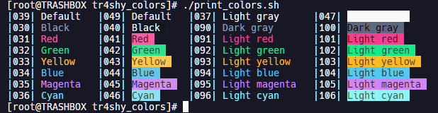

# tr4shy_colors



`tr4shy_colors` is a pastel-neon terminal palette made by tr4shyyy

## Palette

| Token | Hex |
| --- | --- |
| background | `#181825` |
| foreground | `#F9F9F9` |
| cursorColor | `#F9F9F9` |
| selectionBackground | `#434C5E` |
| black | `#181825` |
| red | `#FA5AA4` |
| green | `#2BE491` |
| yellow | `#FA946E` |
| blue | `#63C5EA` |
| purple | `#CF8EF4` |
| cyan | `#89CCF7` |
| white | `#F9F9F9` |
| brightBlack | `#5C6780` |
| brightRed | `#FA5AA4` |
| brightGreen | `#2BE491` |
| brightYellow | `#FA946E` |
| brightBlue | `#63C5EA` |
| brightPurple | `#CF8EF4` |
| brightCyan | `#89CCF7` |
| brightWhite | `#FFFFFF` |

## Files

- `palettes/windows-terminal/tr4shy_colors.json`: raw Windows Terminal color scheme.
- `themes/windows-terminal/tr4shy_colors.theme.json`: matching Windows Terminal UI theme block.
- `palette.json`: flattened export intended to be easy to consume from scripts and generators.

## Windows Terminal

Scheme:

```json
{
  "name": "tr4shy_colors",
  "background": "#181825",
  "black": "#181825",
  "blue": "#63C5EA",
  "brightBlack": "#5C6780",
  "brightBlue": "#63C5EA",
  "brightCyan": "#89CCF7",
  "brightGreen": "#2BE491",
  "brightPurple": "#CF8EF4",
  "brightRed": "#FA5AA4",
  "brightWhite": "#FFFFFF",
  "brightYellow": "#FA946E",
  "cursorColor": "#F9F9F9",
  "cyan": "#89CCF7",
  "foreground": "#F9F9F9",
  "green": "#2BE491",
  "purple": "#CF8EF4",
  "red": "#FA5AA4",
  "selectionBackground": "#434C5E",
  "white": "#F9F9F9",
  "yellow": "#FA946E"
}
```

Theme:

```json
{
  "name": "tr4shy_colors",
  "tab": {
    "background": "#181825FF",
    "iconStyle": "default",
    "showCloseButton": "never",
    "unfocusedBackground": null
  },
  "tabRow": {
    "background": "#181825FF",
    "unfocusedBackground": "#181825FF"
  },
  "window": {
    "applicationTheme": "system",
    "experimental.rainbowFrame": false,
    "frame": null,
    "unfocusedFrame": null,
    "useMica": false
  }
}
```


